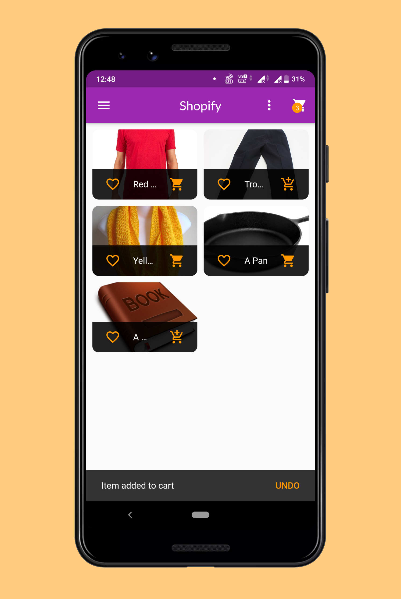
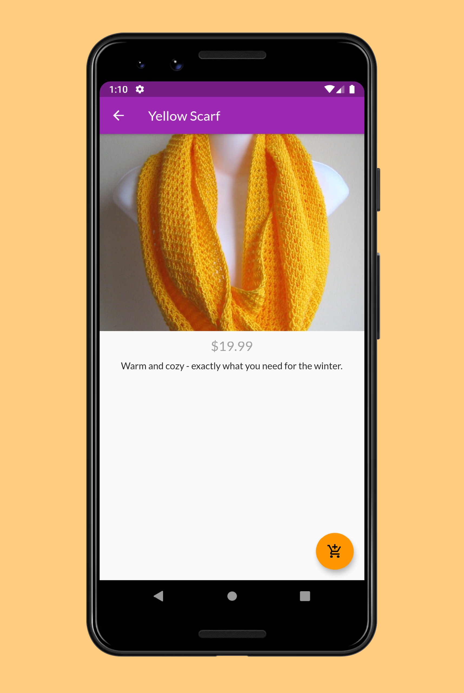

# Shopify

* This application is a basic e-commerce application built in flutter and backend in firebase.

* The entire application is inspired from the course of _Maximilian Schwarzmüller_ over flutter availabe on Udemy.

* The key features of the application are:
1) User Authentication
2) View Products. Add them to Favorite List, Cart List, Orders List.
3) An admin section to edit existing products or to add new products.

## Screenshots 
 
| Screens | Screenshots |
| --------| ----------- |
| Authentication Screen | |
| Products Overview Screen | |
| Products Detail Screen | |
| Cart Screen | |
| Orders Screen | |
| Admin's Products Screen | |
| Edit/Add Products Screen | |

## Getting Started

#### Section 1: Setting Up for Flutter Development

* [Getting Started: Installing Flutter](https://flutter.dev/docs/get-started/install)
* [Git for Windows](https://git-scm.com/download/win)
* [Git for Mac](https://desktop.github.com)
* [Install Android Studio](https://developer.android.com/studio/)
* [iOS Setup Instructions](https://flutter.dev/docs/get-started/install/macos#ios-setup)

#### Section 2: Running this Flutter Project
**Step 1:**
Download or clone this repo by using the link below:

```
https://github.com/imKashyap/Shopify.git
```
**Step 2:**
Go to project root and execute the following command in console to get the required dependencies: 

``` 
flutter pub get 
```

**Step 3:**
In the project root, execute the following command in console to run the app once you have emulator/device ready: 

``` 
flutter run
```
The application must be up and running in the device.

Do fork and star :star: the repo if you find it appreciable.
For any queries and suggestions, Conatct me at my mailing address.
